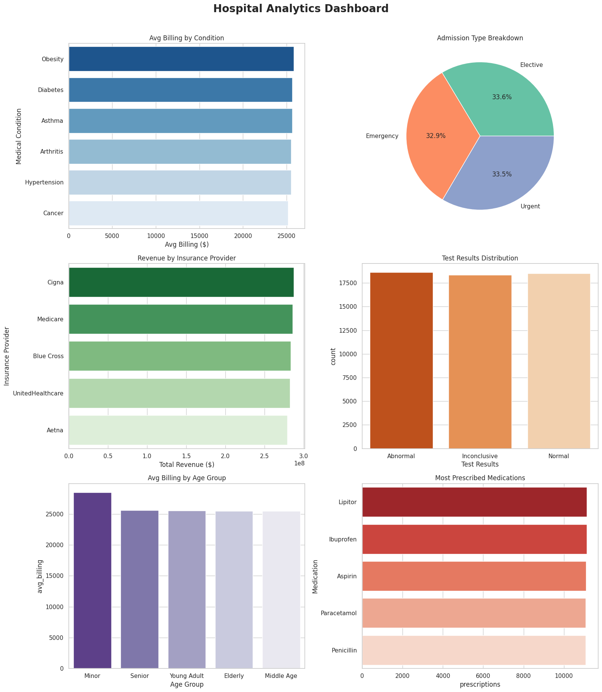

# Hospital Analytics - MySQL Project

## Overview
Analysis of 55,500 patient records using MySQL.

## Dataset
[Healthcare Dataset - Kaggle](https://www.kaggle.com/datasets/prasad22/healthcare-dataset)

## SQL Concepts Covered
- Aggregations, GROUP BY, HAVING
- CASE WHEN (age segmentation)
- CTEs (Common Table Expressions)
- Window Functions (RANK, SUM OVER)
- Subqueries
- Views
- Stored Procedures
- Date Functions (DATEDIFF)

## Key Business Questions Answered
1. What is the average billing by medical condition?
2. Which conditions have the longest hospital stays?
3. What is the 30-day readmission pattern?
4. Revenue breakdown by insurance provider
5. Age group vs billing analysis
6. Doctor patient load analysis
7. Monthly admissions trend
8. Abnormal test results by condition

## Files
- `schema_and_queries.sql` - All 20 analysis queries
- `hospital_analytics.ipynb` - Python + Colab analysis with visualizations

## Colab Notebook
[Run in Google Colab](https://colab.research.google.com/drive/1bIKi4PhU5jIqRvzOHky3Wf2r4guwWPWY?usp=sharing)

## Dashboard Preview

